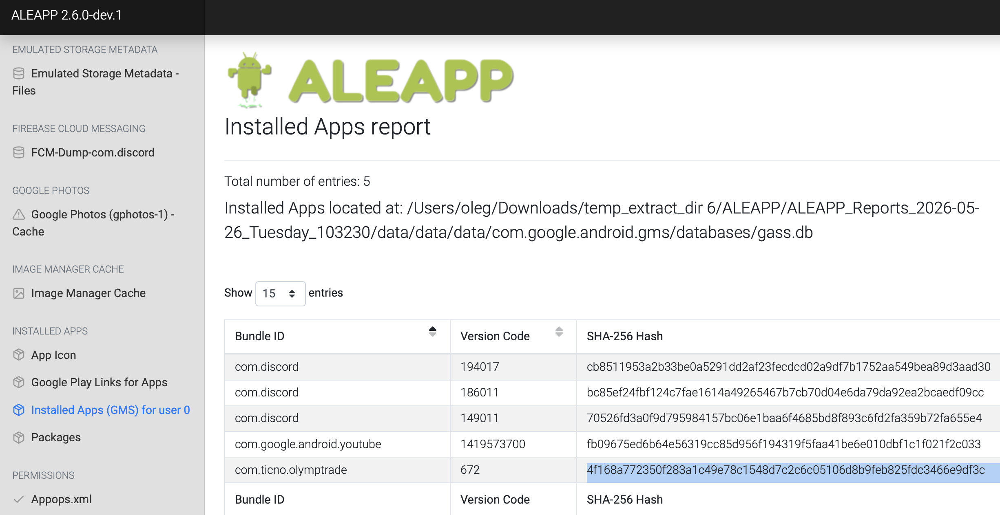
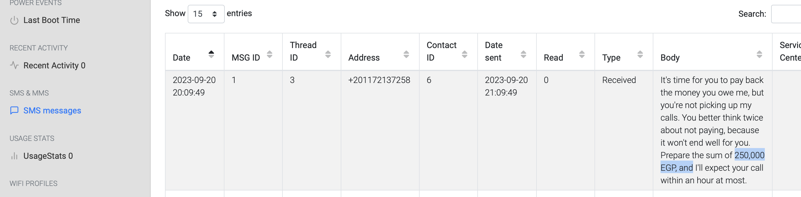
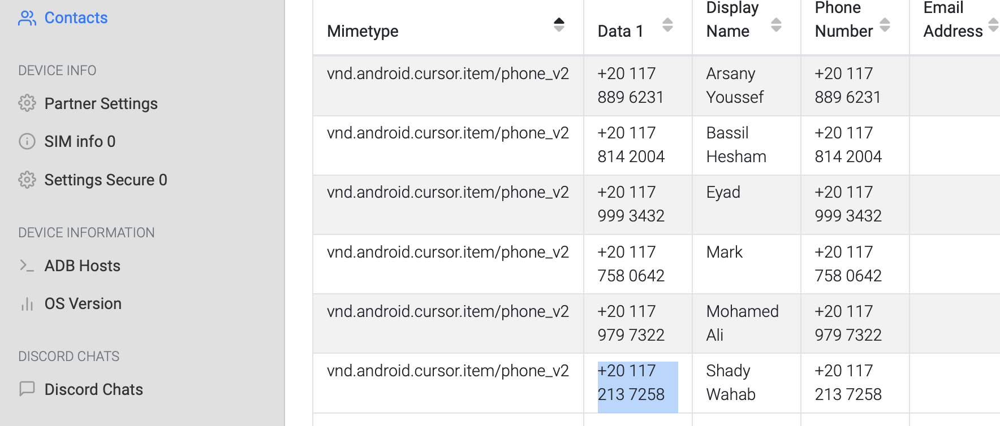
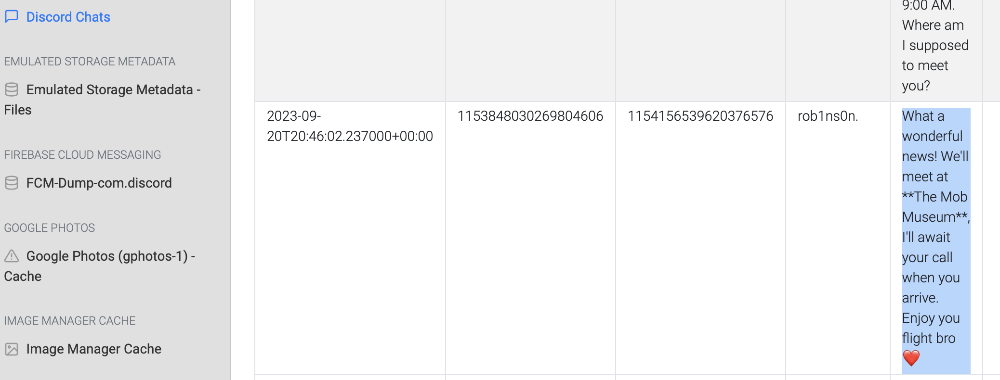

We're currently in the midst of a murder investigation, and we've obtained the victim's phone as a key piece of evidence. After conducting interviews with witnesses and those in the victim's inner circle, your objective is to meticulously analyze the information we've gathered and diligently trace the evidence to piece together the sequence of events leading up to the incident.
https://cyberdefenders.org/blueteam-ctf-challenges/the-crime/

TASK-1

Based on the accounts of the witnesses and individuals close to the victim, it has become clear that the victim was interested in trading. This has led him to invest all of his money and acquire debt. Can you identify the SHA256 of the trading application the victim primarily used on his phone?

Жертва интересовалась криптой. Узнать хеш приложения для торговли криптой которым он пользовался
Загрузим наш архив в ALEAPP (я распаковал, и потом запаковал без пароля) и получим отчет о данных с телефона жертвы. Во вкладке установленные приложения увидим приложение жертвы
4f168a772350f283a1c49e78c1548d7c2c6c05106d8b9feb825fdc3466e9df3c

TASK-2

According to the testimony of the victim's best friend, he said, "While we were together, my friend got several calls he avoided. He said he owed the caller a lot of money but couldn't repay now". How much does the victim owe this person?

Согласно другу жертвы, он задолжал денег. Узнать сколько он должен
Покликав по доступным вкладкам. я нашел эту информацию во вкладке с информацией об СМСках. где жертве поступило очень угрожающее сообщение

250000 египетских денег

TASK-3

What is the name of the person to whom the victim owes money?

Какое имя у человека которому жертва должна денег?

Сопоставим информацию из предыдушего вопроса (номер с кторого пришла СМСка) с контактной книгой жертвы и ответим на этот вопрос

Shady Wahab

TASK-4

Based on the statement from the victim's family, they said that on September 20, 2023, he departed from his residence without informing anyone of his destination. Where was the victim located at that moment?

Согласно заявлениям семьи жертвы он исчез 20 сентября никого не проинформировав. Где он находился в этот момент?

тут что-то картинки не подгрузились, поэтому пришлось лазать в файлах. Нашел эту фотографию в папке recent activity, где был скриншот из гугл карт с геолокацией в отеле
The Nile Ritz-Carlton

TASK-5

The detective continued his investigation by questioning the hotel lobby. She informed him that the victim had reserved the room for 10 days and had a flight scheduled thereafter. The investigator believes that the victim may have stored his ticket information on his phone. Look for where the victim intended to travel.

Детектив пришла в отель и сказала, что у жертвы были билеты. Инфа о них должна быть в телефоне жертвы.

Ну тут тоже не подгрузилось, пришлось пошариться по папкам и найти эту информацию в гугл фото, где была картинка с билетом в
Las Vegas

TASK-5

After examining the victim's Discord conversations, we discovered he had arranged to meet a friend at a specific location. Can you determine where this meeting was supposed to occur?

В Вегасе жертва хотела встретиться с другом в определенной локации.

Найдем инфу об этом в разделе Discord chats

