As a cybersecurity analyst at an educational institution, you receive an alert about a phishing email targeting faculty members. The email appears to be from a trusted contact and claims a $625,000 purchase, providing a link to download an invoice.
Your task is to investigate the email using Threat Intel tools. Analyze the email headers and inspect the link for malicious content. Identify any Indicators of Compromise (IOCs) and document your findings to prevent potential fraud and educate faculty on phishing recognition.

https://cyberdefenders.org/blueteam-ctf-challenges/phishstrike/
TASK-1

Identifying the sender's IP address with specific SPF and DKIM values helps trace the source of the phishing email. What is the sender's IP address that has an SPF value of softfail and a DKIM value of fail?

(узнать значения указанных полей)

Грепим по файлу email, grep -C 3 'softfail' 194-PhishStrike.eml

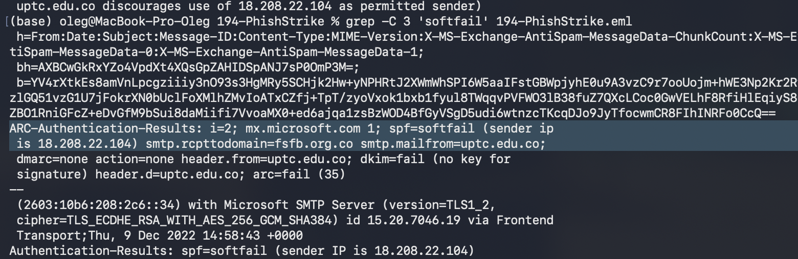

TASK-2

Understanding the return path of an email is essential for tracing its origin. What is the return path specified in this email?

Return-Path письма, также грепим grep -C 3 'Return-Path' 194-PhishStrike.eml

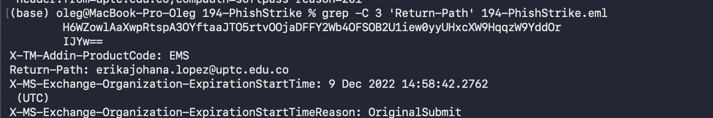

TASK-3

Identifying the source of malware is critical for effective threat mitigation and response. What is the IP address of the server hosting the malicious file related to malware distribution?

Найдем IP-адрес сервера который хостит вредоносные файлы.

Продолжаем грепить письмо. Тут воспользуемся регуляркой чтобы выудить все ip, а потом проверим (и найдем нужный) их на VT

(base) oleg@MacBook-Pro-Oleg 194-PhishStrike % grep -E -o -C 3 "([0-9]{1,3}\.){3}[0-9]{1,3}"  194-PhishStrike.eml

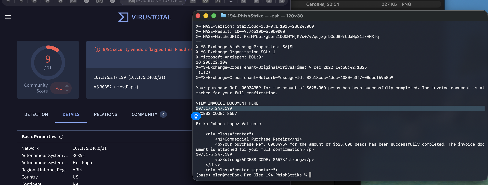

TASK-4

Identifying malware that exploits system resources for cryptocurrency mining is critical for prioritizing threat mitigation efforts. The malicious URL can deliver several malware types. Which malware family is responsible for cryptocurrency mining?

Какая малварь (в этом контексте) ответственна за майнинг? Смотрим в related files на VT, в одном из файлов будет вполне настораживающие название

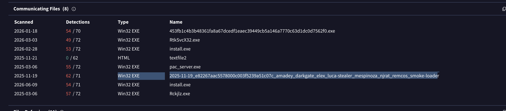

TASK-5

Identifying the specific URLs malware requests is key to disrupting its communication channels and reducing its impact. Based on the previous analysis of the cryptocurrency malware sample, what does this malware request the URL?

Куда малварь стучится? 
Вот тут я не очень понял, как это должны были найти, однако если посмотреть на домен под ip, а потом посмотерть communicating files у домена, ответом будет первый же файл. Ну, точнее, куда он стучится

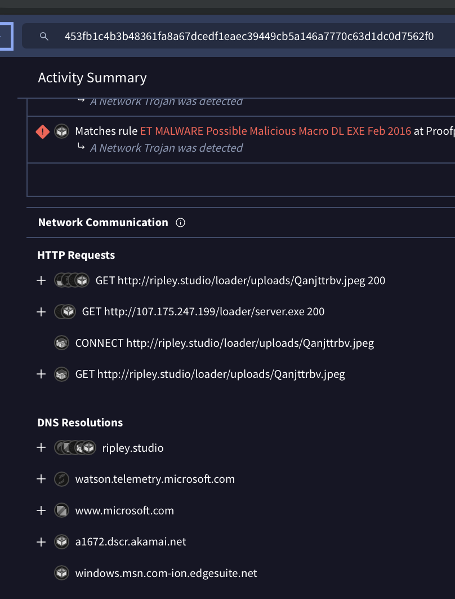

TASK-6

Understanding the registry entries added to the auto-run key by malware is crucial for identifying its persistence mechanisms. Based on the BitRAT malware sample analysis, what is the executable's name in the first value added to the registry auto-run key?

Здесь немного сложнее. С предыдущей ссылкой идем на URLHaus, и там будут два сэмпла. Один из них - bitrat. Для него смотрим хэш в VT, и во вкладке поведения смотри какие ключи ставит

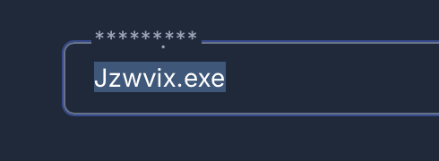

TASK-7

Identifying the SHA-256 hash of files downloaded from a malicious URL is essential for tracking and analyzing malware activity. Based on the BitRAT analysis, what is the SHA-256 hash of the file previously downloaded and added to the autorun keys?

В dropped files из пердыдущего -> смотрим файл с таким названием и видим наш нужный хэш

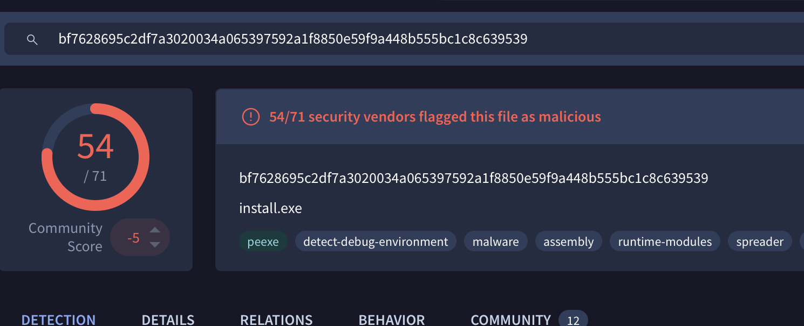

TASK-8

Analyzing the HTTP requests made by malware helps in identifying its communication patterns. What is the URL in the HTTP request used by the loader to retrieve the BitRAT malware?

Снова несложный вопрос на выявление C2-инфраструктуры. 

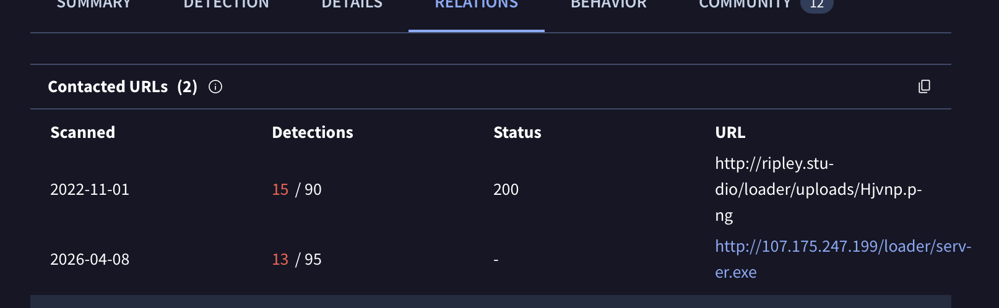

TASK-9

Introducing a delay in malware execution can help evade detection mechanisms. What is the delay (in seconds) caused by the PowerShell command according to the BitRAT analysis?

Задержка в секундах для уклонения от песочниц. Смотрим в behaviour в VT, будет закодированная в base64 powershell команда

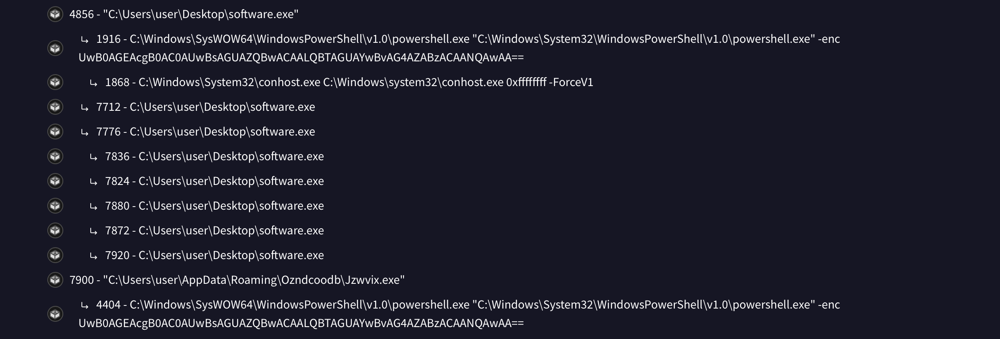

TASK-10

Tracking the command and control (C2) domains used by malware is essential for detecting and blocking malicious activities. What is the C2 domain used by the BitRAT malware?

Опять вопрос на выявление C2 инфры. Немного неочевидный, поэтому смотрим че народ пишет

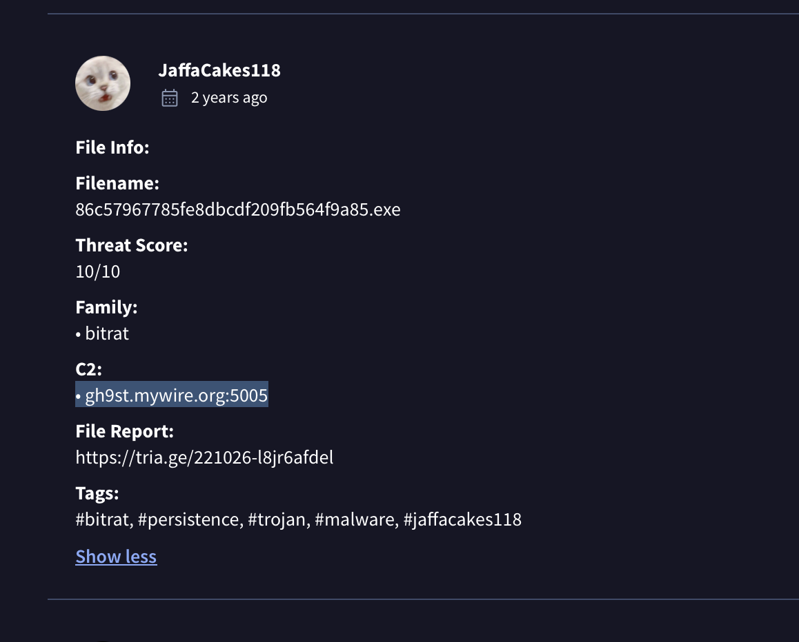

TASK-11

Understanding how malware exfiltrates data is essential for detecting and preventing data breaches. According to the AsyncRAT analysis, what is the Telegram Bot ID used by this malware?

По сэмплу AsyncRAT из ссылки в URLHaus перейдем в ASYNCRAT, найдем отчет triage и там увидим id

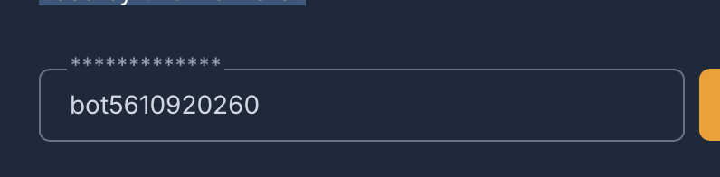

