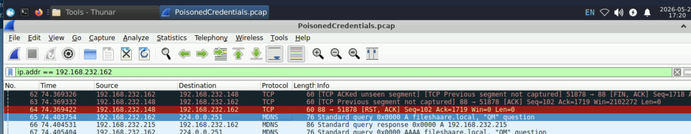
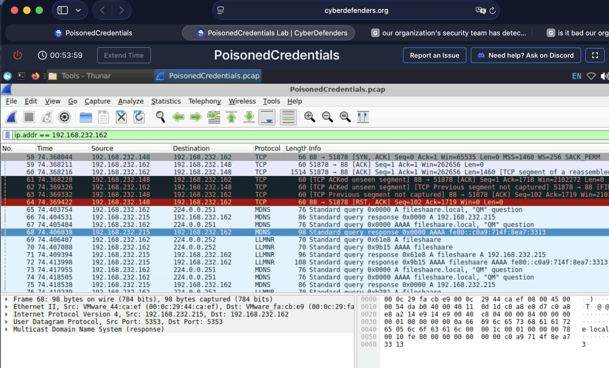
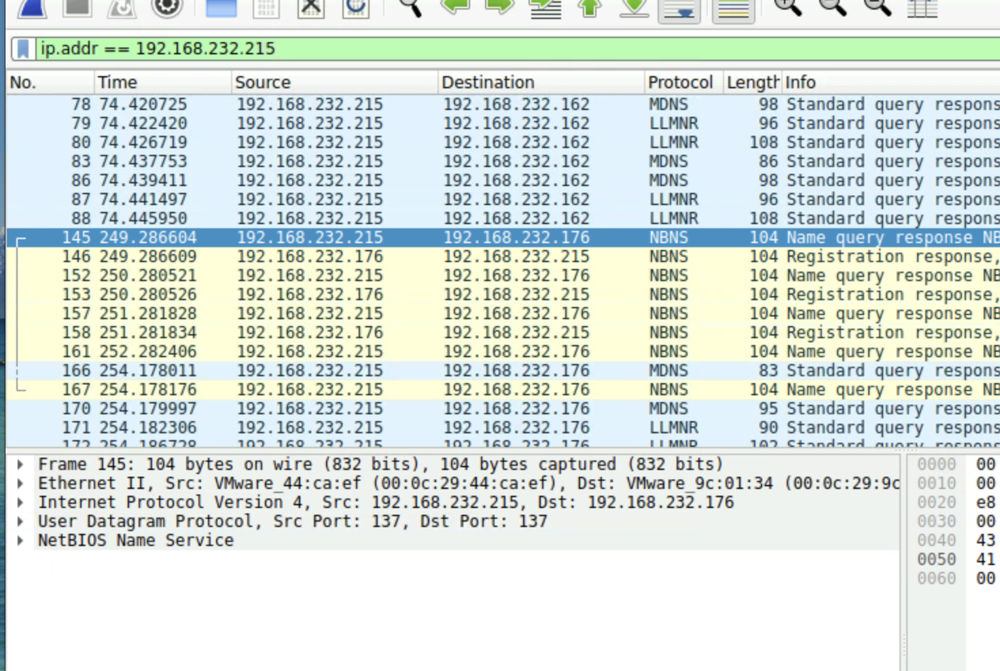
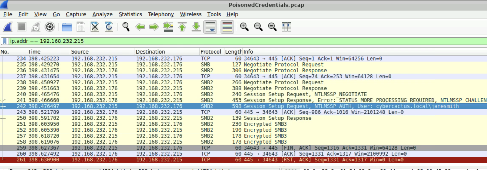
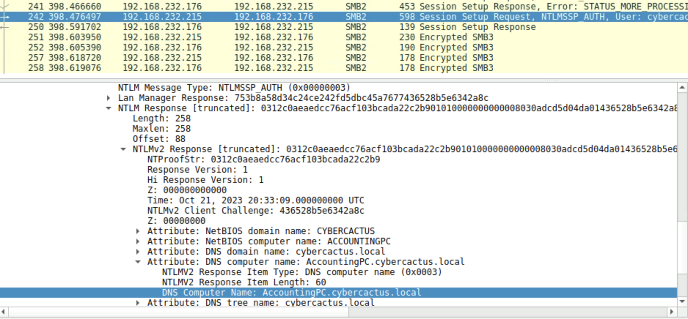

Your organization's security team has detected a surge in suspicious network activity. There are concerns that LLMNR (Link-Local Multicast Name Resolution) and NBT-NS (NetBIOS Name Service) poisoning attacks may be occurring within your network. These attacks are known for exploiting these protocols to intercept network traffic and potentially compromise user credentials. Your task is to investigate the network logs and examine captured network traffic.

TASK-1

In the context of the incident described in the scenario, the attacker initiated their actions by taking advantage of benign network traffic from legitimate machines. Can you identify the specific mistyped query made by the machine with the IP address 192.168.232.162?

(определить опечатку в доменном имени)

Выбираем фильтр ip.addr == 192.168.232.162 и листаем запросы, пока не найдем запрос по протоколу MDNS на запись с опечаткой (fileshaare.local)

TASK-2

We are investigating a network security incident. To conduct a thorough investigation, We need to determine the IP address of the rogue machine. What is the IP address of the machine acting as the rogue entity?

(определить ip нарушителя)

Смотрим ip машины ответившей на ошибочный DNS запрос
(я просто пролистал вниз)

TASK-3

As part of our investigation, identifying all affected machines is essential. What is the IP address of the second machine that received poisoned responses from the rogue machine?

Здесь ставим фильтр на ip злоумышленника, и смотрим с кем он общался, найдем второй хост

TASK-4

We suspect that user accounts may have been compromised. To assess this, we must determine the username associated with the compromised account. What is the username of the account that the attacker compromised?

Найдем сессию со вторым хостом и внимательно посмотрим детали

TASK-5

As part of our investigation, we aim to understand the extent of the attacker's activities. What is the hostname of the machine that the attacker accessed via SMB?

Смотрим карточку сессии

