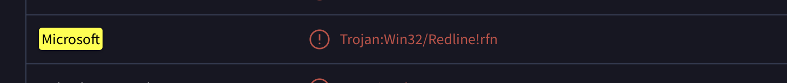
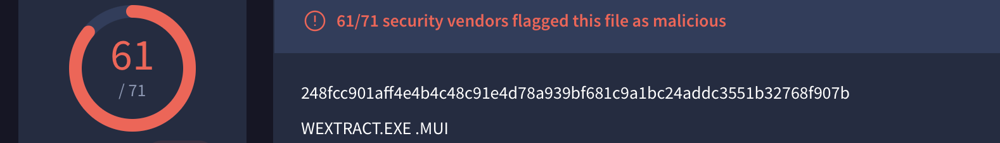
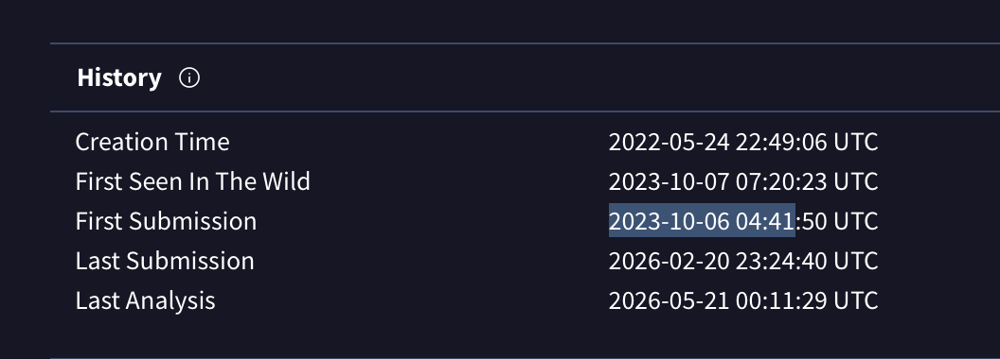
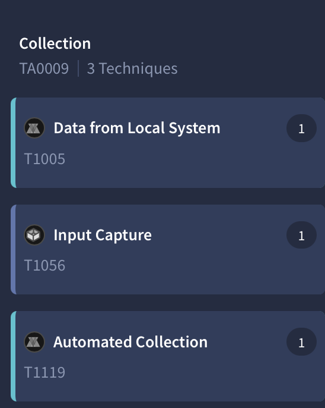
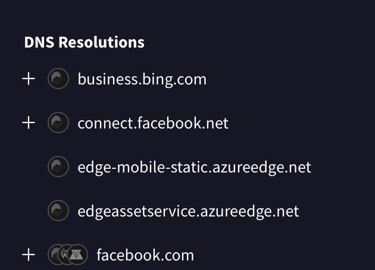

You are part of the Threat Intelligence team in the SOC (Security Operations Center). An executable file has been discovered on a colleague's computer, and it's suspected to be linked to a Command and Control (C2) server, indicating a potential malware infection.
Your task is to investigate this executable by analyzing its hash. The goal is to gather and analyze data beneficial to other SOC members, including the Incident Response team, to respond to this suspicious behavior efficiently.

TASK-1

Categorizing malware enables a quicker and clearer understanding of its unique behaviors and attack vectors. What category has Microsoft identified for that malware in VirusTotal?

(определить как микрософт определили малварь в VT)

Ну что тут думать, пастим хэш в VT и смотрим вердикт мелкомягких

TASK-2

Clearly identifying the name of the malware file improves communication among the SOC team. What is the file name associated with this malware?

(название малвари)

Также очевидно, мотаем в верх и видим вердикт

TASK-3

Knowing the exact timestamp of when the malware was first observed can help prioritize response actions. Newly detected malware may require urgent containment and eradication compared to older, well-documented threats. What is the UTC timestamp of the malware's first submission to VirusTotal?

Переходим во вкладочку детали и смотрим когда его в первый раз залили на VT

TASK-4

Understanding the techniques used by malware helps in strategic security planning. What is the MITRE ATT&CK technique ID for the malware's data collection from the system before exfiltration?

Переходим во вкладочку BEHAVIOR и смотрим на сигнатуры MITRE, этап Collection
Будет первая же техника

TASK-5

Following execution, which social media-related domain names did the malware resolve via DNS queries?

Продолжаем анализировать поведение. Проматываем до DNS Resolutions, видим ответ. Зачем он туда чтучится? Да чтобы не палиться и слиться со случайным трафиком

