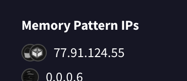
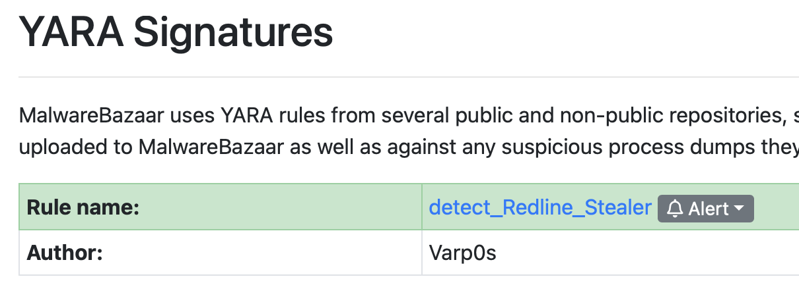
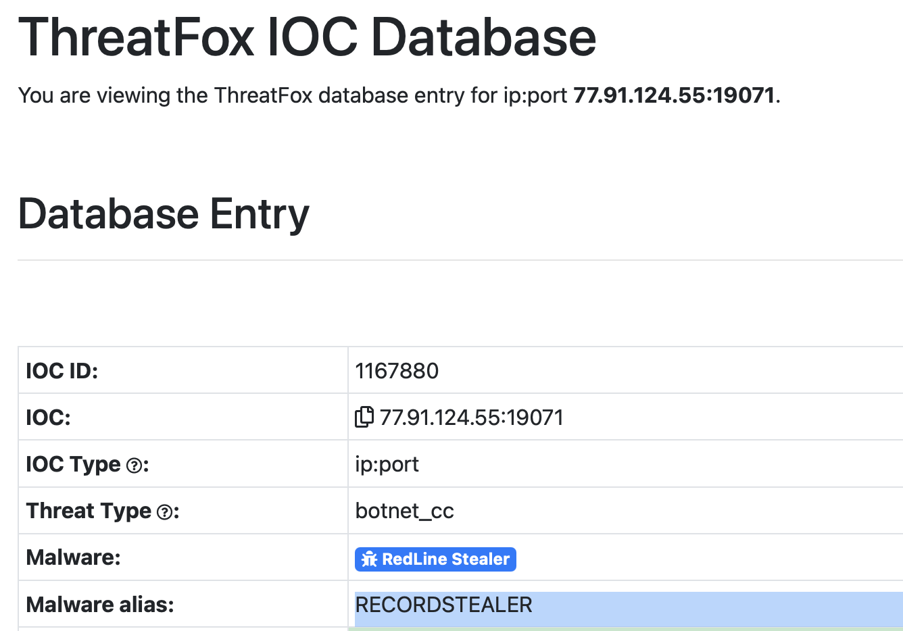
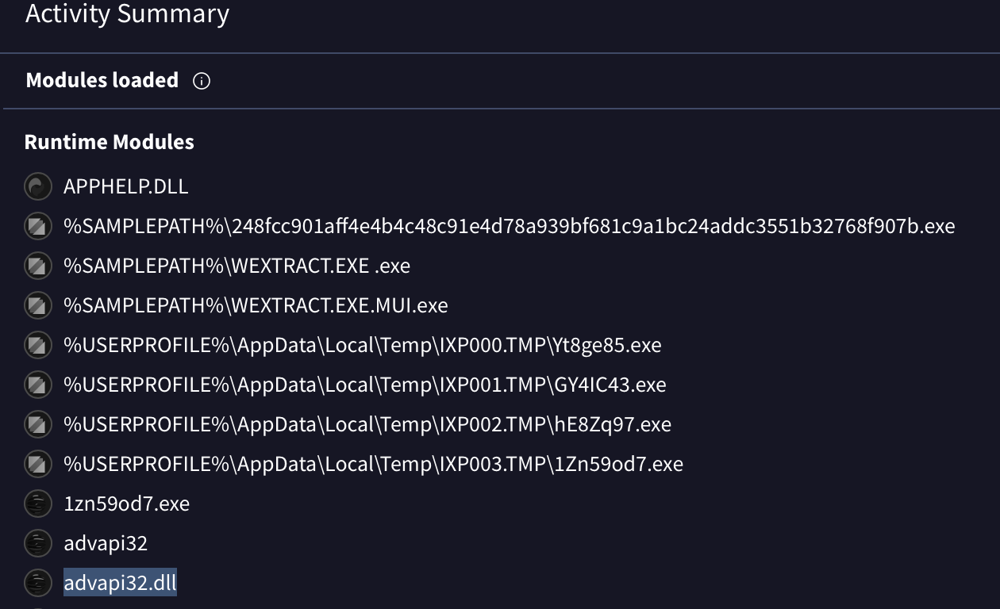

You are part of the Threat Intelligence team in the SOC (Security Operations Center). An executable file has been discovered on a colleague's computer, and it's suspected to be linked to a Command and Control (C2) server, indicating a potential malware infection.
Your task is to investigate this executable by analyzing its hash. The goal is to gather and analyze data beneficial to other SOC members, including the Incident Response team, to respond to this suspicious behavior efficiently.

TASK-1

Categorizing malware enables a quicker and clearer understanding of its unique behaviors and attack vectors. What category has Microsoft identified for that malware in VirusTotal?

(определить как микрософт определили малварь в VT)

Ну что тут думать, пастим хэш в VT и смотрим вердикт мелкомягких

TASK-2

Clearly identifying the name of the malware file improves communication among the SOC team. What is the file name associated with this malware?

(название малвари)

Также очевидно, мотаем в верх и видим вердикт

TASK-3

Knowing the exact timestamp of when the malware was first observed can help prioritize response actions. Newly detected malware may require urgent containment and eradication compared to older, well-documented threats. What is the UTC timestamp of the malware's first submission to VirusTotal?

Переходим во вкладочку детали и смотрим когда его в первый раз залили на VT

TASK-4

Understanding the techniques used by malware helps in strategic security planning. What is the MITRE ATT&CK technique ID for the malware's data collection from the system before exfiltration?

Переходим во вкладочку BEHAVIOR и смотрим на сигнатуры MITRE, этап Collection
Будет первая же техника

TASK-5

Following execution, which social media-related domain names did the malware resolve via DNS queries?

Продолжаем анализировать поведение. Проматываем до DNS Resolutions, видим ответ. Зачем он туда чтучится? Да чтобы не палиться и слиться со случайным трафиком

TASK-6

Once the malicious IP addresses are identified, network security devices such as firewalls can be configured to block traffic to and from these addresses. Can you provide the IP address and destination port the malware communicates with?

Данный вопрос относится к парамтру "Memory pattern URLs". Это ссылки, захардкоженные в бинарнике файла, обнаруживаются при статическом анализе

TASK-7

YARA rules are designed to identify specific malware patterns and behaviors. Using MalwareBazaar, what's the name of the YARA rule created by "Varp0s" that detects the identified malware?

Найдем по хешу (sha256:248fcc901aff4e4b4c48c91e4d78a939bf681c9a1bc24addc3551b32768f907b) на MalwareBaazar и посмотрим YARA правило

TASK-8

Understanding which malware families are targeting the organization helps in strategic security planning for the future and prioritizing resources based on the threat. Can you provide the different malware alias associated with the malicious IP address according to ThreatFox?

Здесь как искать по хешу не сообразил, однако так как у нас уже есть IP потенциального C2 сервера (согласно захардкоженным URL) мы можем найти по тегу ioc:77.91.124.55 и увидеть альтернативное имя

TASK-9

By identifying the malware's imported DLLs, we can configure security tools to monitor for the loading or unusual usage of these specific DLLs. Can you provide the DLL utilized by the malware for privilege escalation?

Посмотрим какие dllки он подгружает. Видим несколько, однако нам нужна только которая была использована для повышения привилегий
гуглим advapi32.dll и смотрим за что он отвечает
ADVAPI32.dll (Advanced Windows 32 Base API) — это важнейший системный компонент операционной системы Windows. Он отвечает за работу с безопасностью, управление учетными записями, правами доступа и системным реестром.
думайте, как говориться

